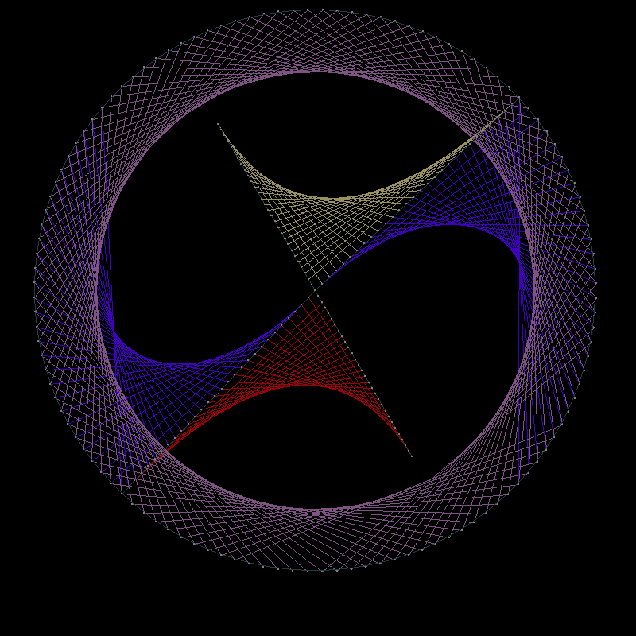
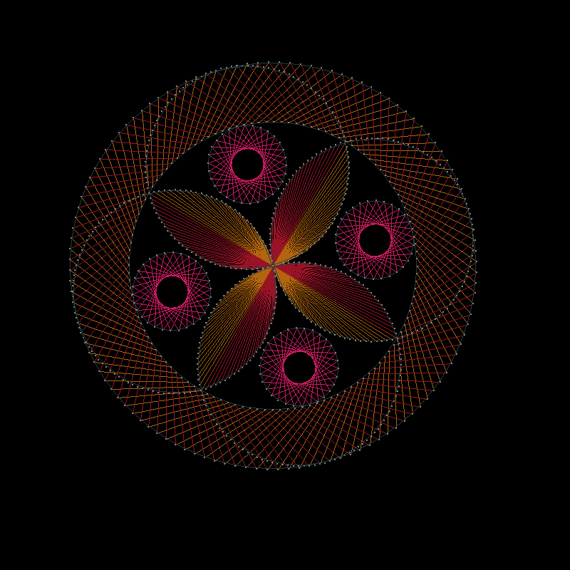
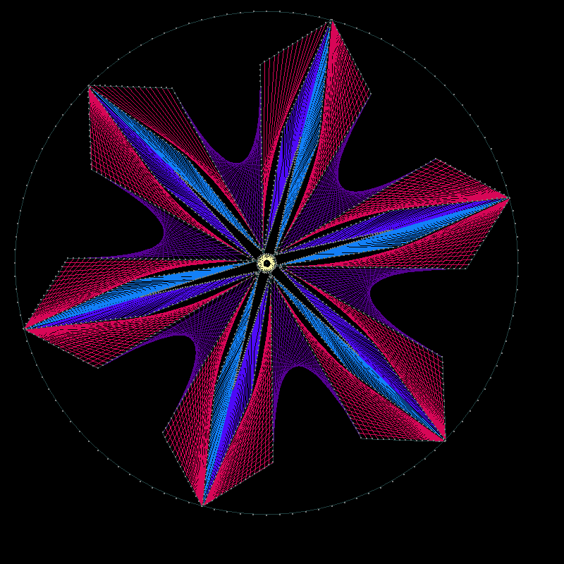
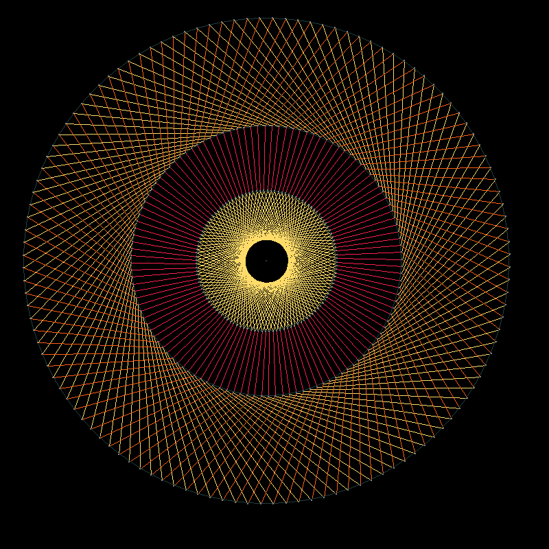
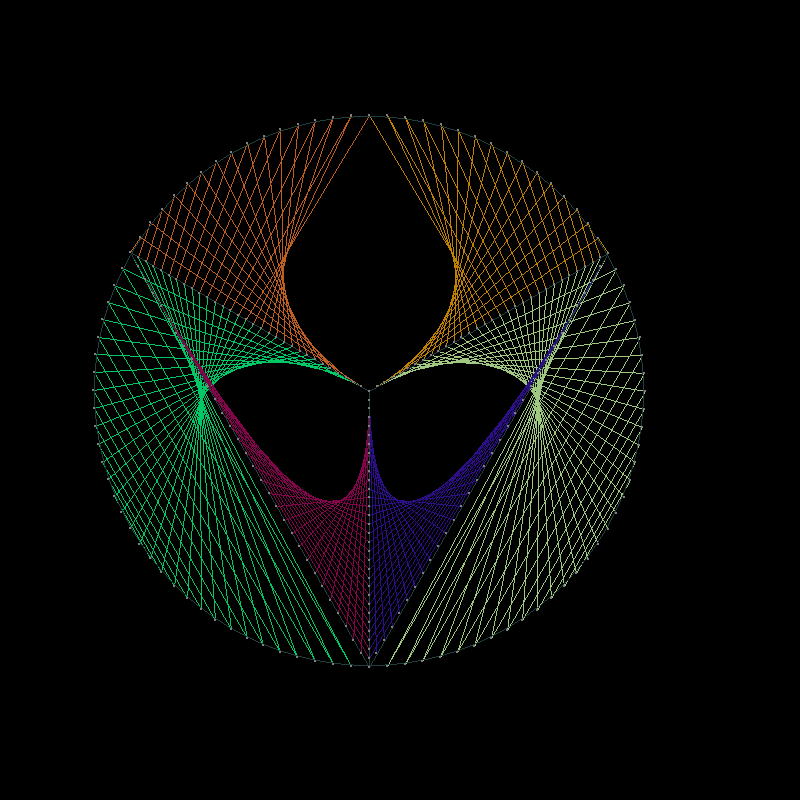

## About
*qwerasfd* is a GUI tool to make string mandala art designs. (pretty geometric art).  
It is implemented in python and depends on *numpy* and *pygame*

## Gallery
Once you're comfortable with the UI and you know the result you're going for,
images like these can be made in 5-10 minutes.







## Install
#### 1. install python:
On windows just downloaded [the official latest release of python](https://www.python.org/downloads/windows/)
and launch the install wizard as you normally would.  
Make sure to **check the box** that says `Add Python3.xx to PATH` in the first screen of the wizard.

On systems with a package manager (assuming `apt` for the example), something like this should work:  
`sudo apt install python3 pip`

#### 2. install depencies
From commandline:  
`pip install numpy pygame`

## Run
* from commandline:  
```
cd path/where/you/cloned/this/repo
python3 run.py
```
* Windows will also let you double click `.py` files to run them after you've installed python.
`run.py` is the file you want.

## Use
* The menu in the bottom area of the screen tells you keys you can press to do things
	* when you press a key, the actions mouse-clicks, etc do will change contextually. 
(for example, after `D: New Shape`, `D: New Circle`, left-click will place the center of the circle)
	* hints about what you can do will be displayed at the bottom of the screen
* Most of the time (ie except when the mouse-wheel is contextually being used for something else)
you can zoom/use the view by scrolling.
* When at the root of the menu (ie just after launch, or after pressing `Z`) you can right-click to move the view around
(right-click again to release)
* You can enter Commad-Mode by pressing `C`, which allow you to run certain commands by typing them
	* use `Enter` on an empty prompt or `Ctrl+C` to exit the Command-Mode
	* `long_name/name/synonym` syntax with slashes indicates a command has several names
	* `ls_cmd/ls` to display a list of all commands
	* `usage/us <command_name>` to display a short message about what arguments a command expects
	* `help/h <command_name>` to display a short message about what a command does


