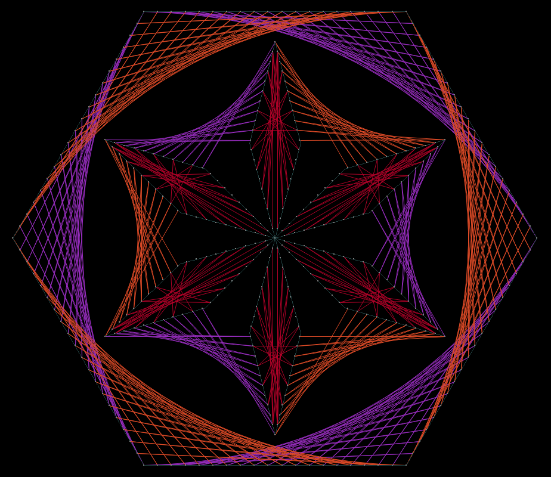
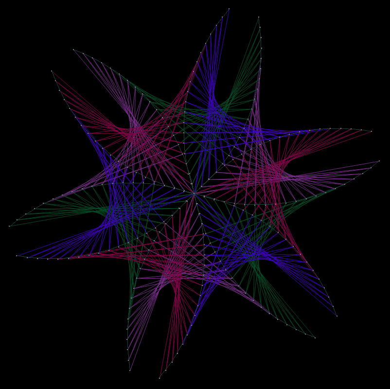

## About
`qwerasfd` is a GUI tool to make string mandala art designs. (pretty geometric art).  
It is implemented in python and depends on `numpy` and `pygame`.  
I put an MIT license in there just in case.  

## Install & Run

### Short Version (for people used to python)
Install with `pip install .`  
Run as `qwerasdf` or run the `qwerasdf-run.py` script (requires prior installation; can be safely moved).  

### 1. Make sure `Python3` and `pip` are installed on your system
On windows just downloaded [the official latest release of python](https://www.python.org/downloads/windows/)
and launch the install wizard as you normally would.  
Make sure to **check the box** that says `Add Python3.xx to PATH` in the first screen of the wizard.

On systems with a package manager (assuming `apt` for the example), something like this should do the trick:  
`sudo apt install python3 pip`

### 2. Install with pip
Run the `pip install .` command from the root of the repo.  
Note: you can then uninstall with `pip uninstall qwerasdf`.  

### 3. Run
After installation, you can run the progarm either from the commandline as `qwerasdf`,
or launching the `qwerasdf-run.pyw` script with python. (You can move it wherever you like)  
Note: Windows should also have a generated `qwerasdf.exe` executable **somewhere** which should be pretty much equivalent

## How to Use
For instructions on how to use the program, read the [manual](manual.md)

## Gallery

